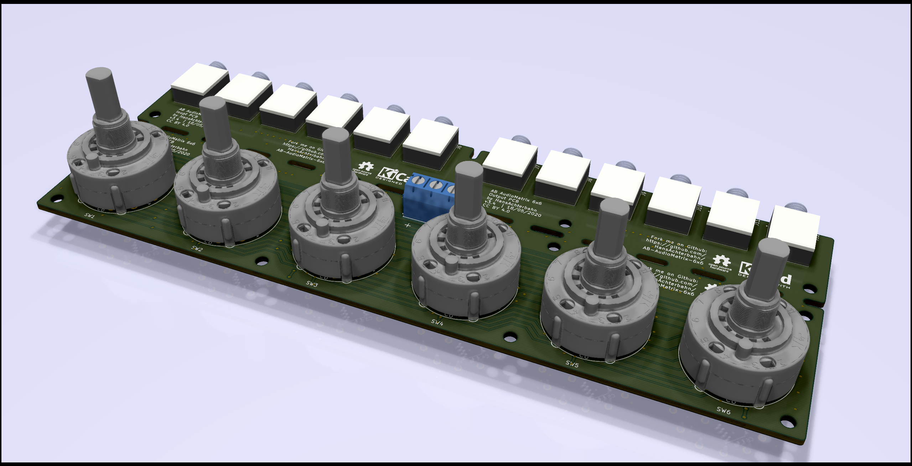
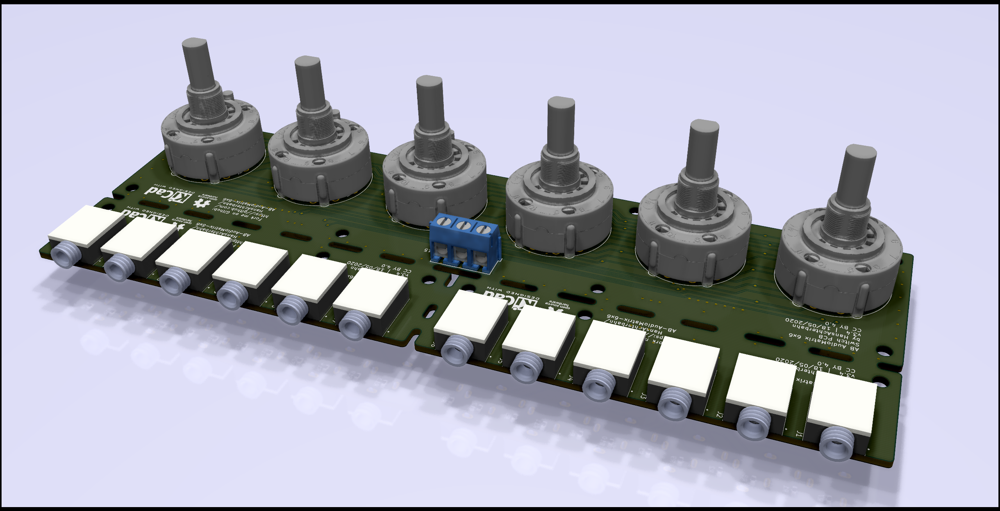
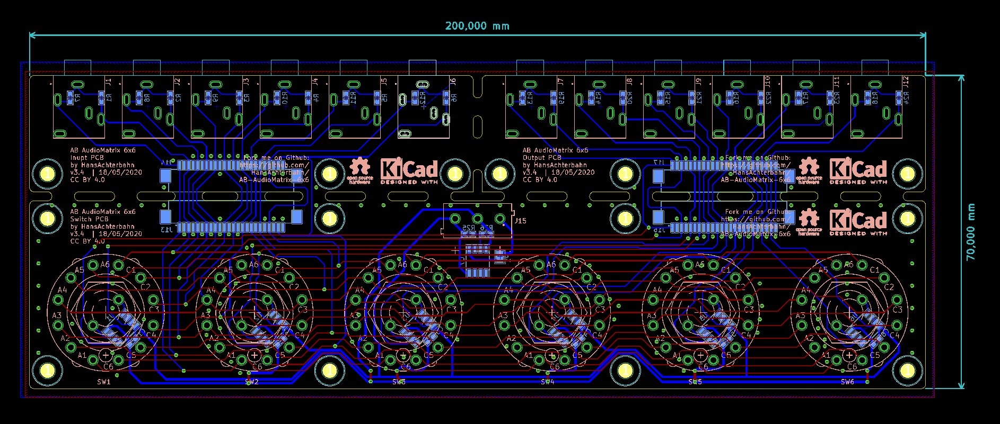

# AB AudioMatrix 6x6

Active audio matrix (6x6), which can map 6 input channels to 6 output channels. Connection via 3.5 jack cable. Compatible with line signals (aux, headphones, active speakers, ...).

*Fork me and have fun!*

## Pictures

Comming soon ...

## 3D View

Front view

Rear view

## Schematic

Page 1: Master

Page 2: Switches and OPAs

Page 3: Audio Input and Output

## Board

Board

## Licence

<a rel="cc:attributionURL" href="https://github.com/HansAchterbahn/AB-AudioMatrix-6x6">AB AudioMatrix 6x6</a> by <a rel="cc:attributionURL" href="https://github.com/HansAchterbahn/">Hans Achterbahn </a>CC BY 4.0 

