# AB AudioMatrix 6×6

Active audio matrix (6×6), that can map 6 input channels (1-6) to 6 output channels (A-F). Connection via 3.5 jack cable. Compatible with line signals, aux, headphones and active speakers. Each output channel can map one input channel at a time.

*Fork me and have fun!*

## 1 Content and Structure

| File / Folder                 | Abbreviation     | Description                                                                             |
| ----------------------------- | ---------------- | --------------------------------------------------------------------------------------- |
| /3d/                          | 3D models        | Files to work with in a 3D CAD program                                                  |
| /bom/                         | Bill of Material | Files with needed components and corresponding order number from different distributors |
| /case/                        | Case for PCB     | Files with an example case for the PCBs                                                 |
| /doc/                         | Documentation    | Files needed in README.md to document the repository                                    |
| /gerber/                      | Gerber files     | Files exported from Board Layout to order the PCBs from a manufacturer                  |
| /sch/                         | Schematic        | Additional schematic files                                                              |
| /AB-AudioMatrix-6x6.pro       | —                | Kicad Project File                                                                      |
| /AB-AudioMatrix-6x6.sch       | —                | Root schematic files                                                                    |
| /AB-AudioMatrix-6x6.kicad_pcb | —                | PCB / Board Layout File                                                                 |
| /LICENSE.md                   | —                | File contains project license                                                           |
| /README.md                    | —                | Markdown file with the documentation you are reading now                                |

## 2 Power Supply Modes

| Mode       | +             | —             | ⊥   | Jumper JP1 | U7, R25, R26  | Info                                                              |
| ---------- | ------------- | ------------- | --- | ---------- | ------------- | ----------------------------------------------------------------- |
| Symmetric  | +2.5 to +15 V | -2.5 to -15 V | 0V  | Open       | not necessary | Highly recommended for good Sound and clearly separated channels  |
| Asymmetric | +5 to +30 V   | 0 V           | --- | Closed     | necessary     | Possible, but not recommended; Channels are not clearly separated |

## 3 Pictures

### 3.1 Mounted device

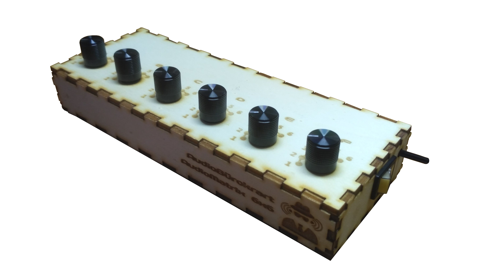
Front view

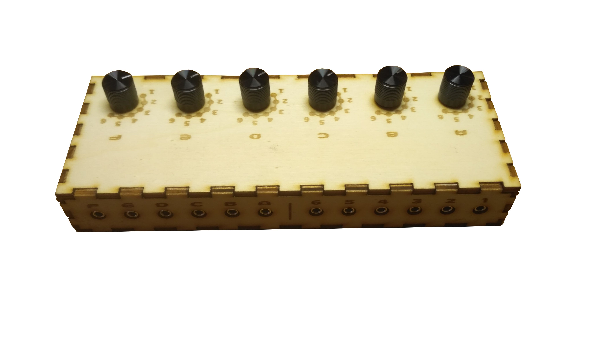
Rear view

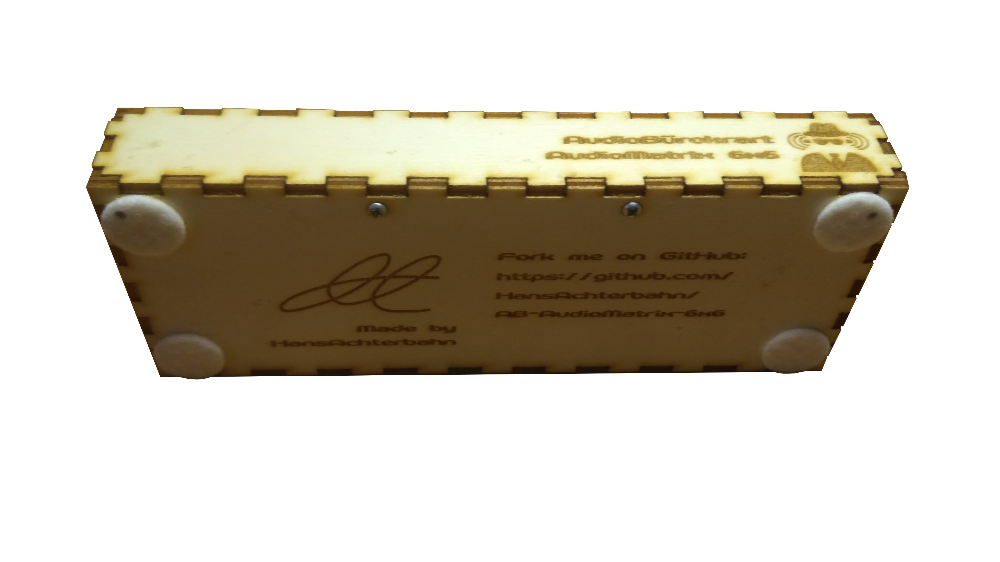
Bottom view

### 3.2 Board

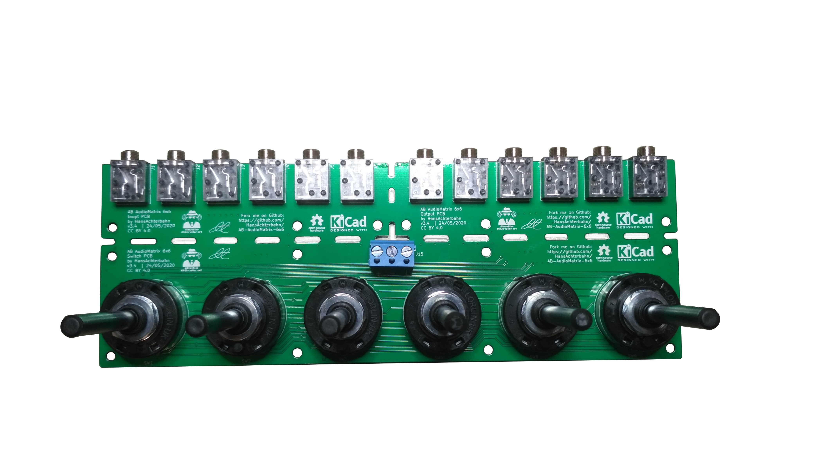
Top view

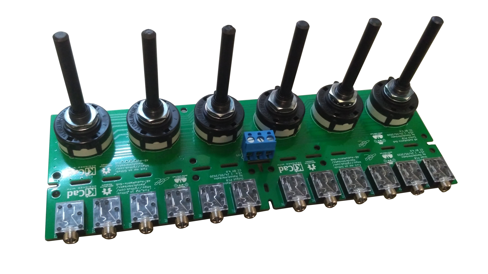
Rear view

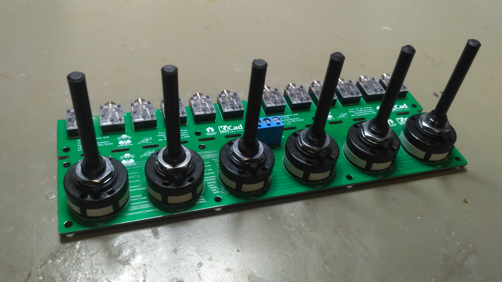

<!--
## 4 CAD Data

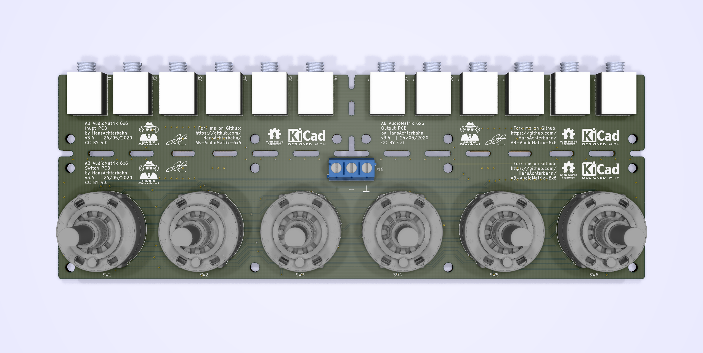
Top view

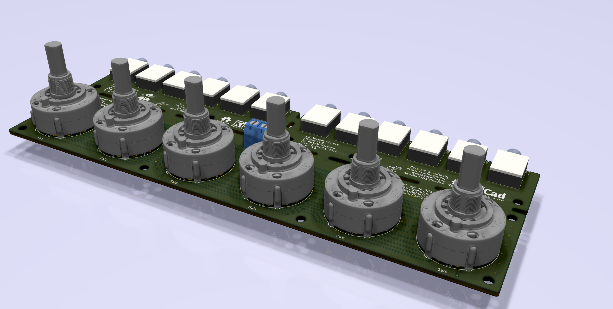
Front view

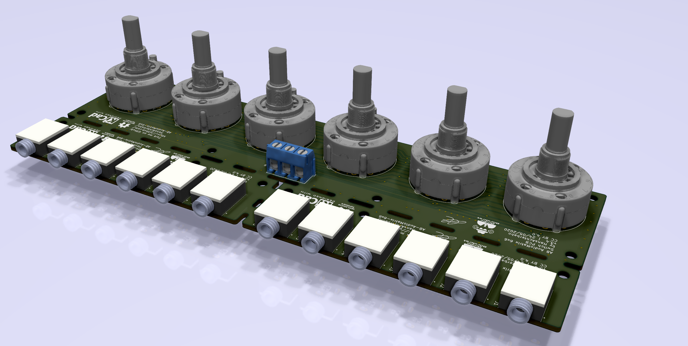
Rear view

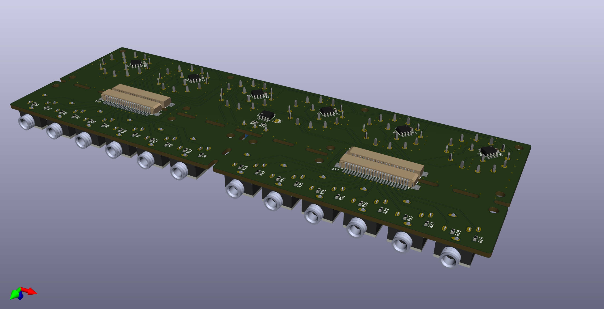
Bottom view
-->

## 4 Schematic

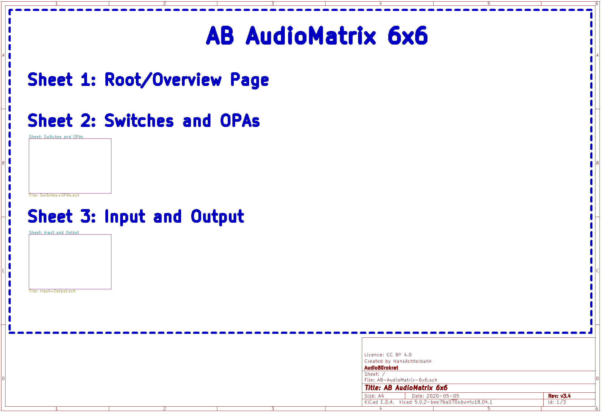
Sheet 1: Root / Overview Page

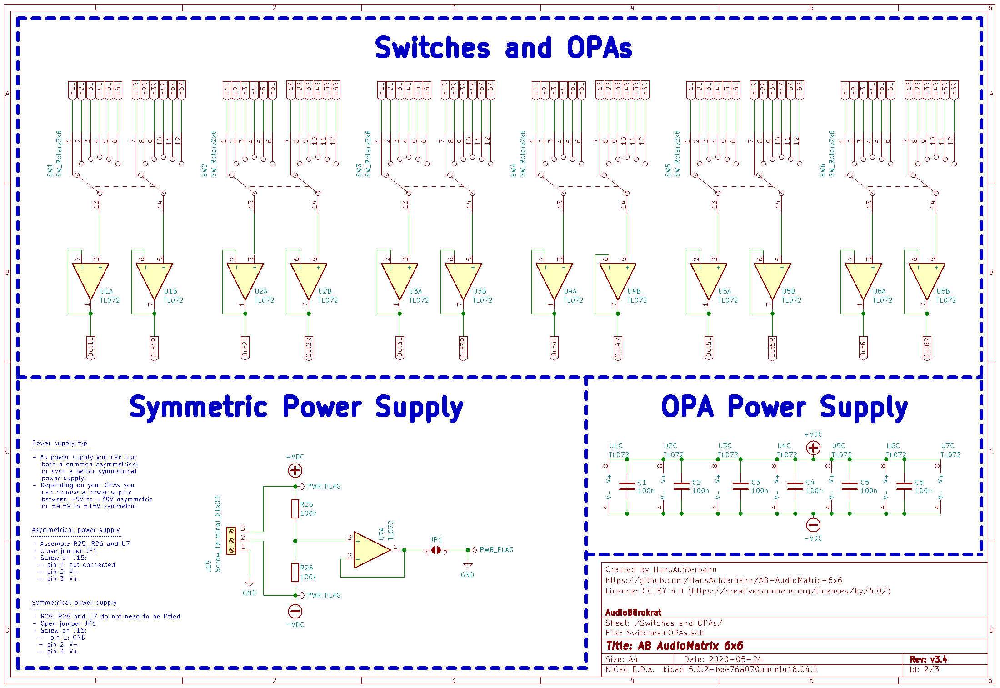
Sheet 2: Switches and OPAs

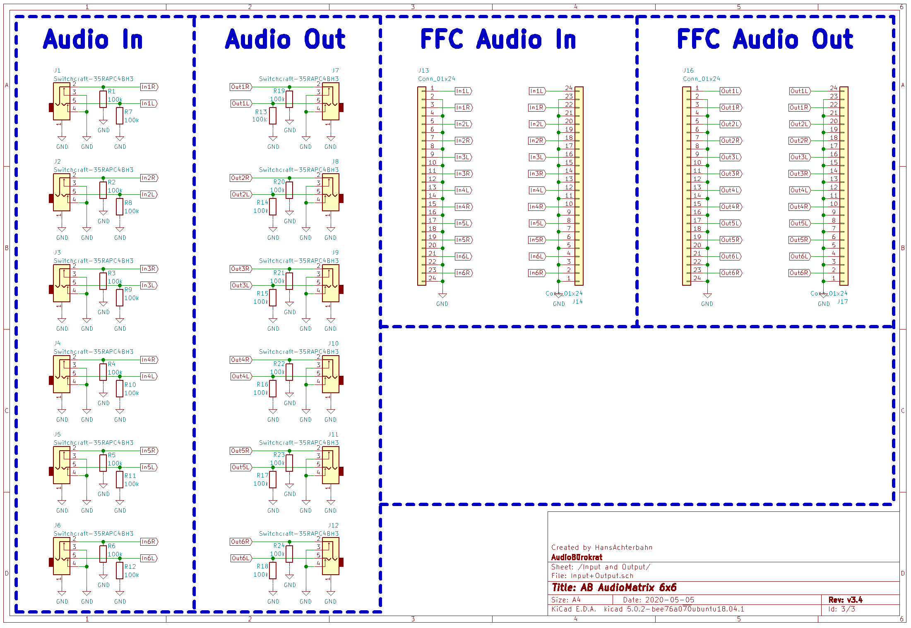
Sheet 3: Audio Input and Output

## 5 Board Layout

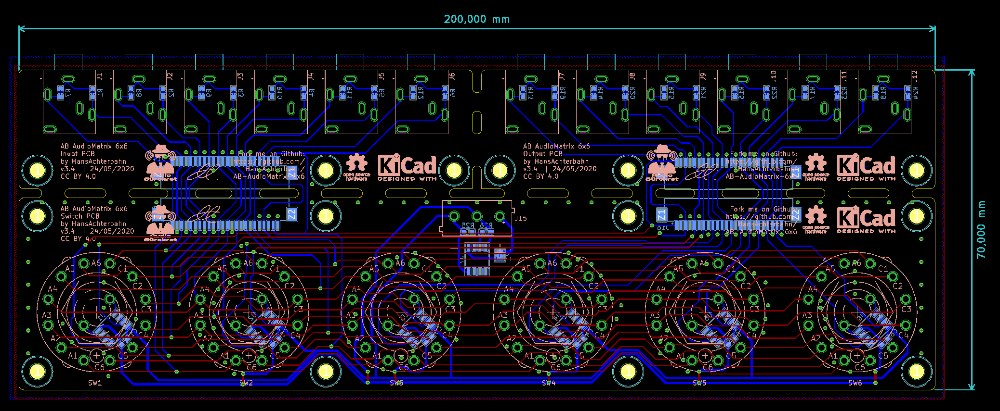
PCB / Board layout

## 6 License

<a rel="cc:attributionURL" href="https://github.com/HansAchterbahn/AB-AudioMatrix-6x6">AB AudioMatrix 6×6</a> by <a rel="cc:attributionURL" href="https://github.com/HansAchterbahn/">Hans Achterbahn </a>CC BY 4.0 

